# Housing Data Pipeline

### Introduction
___
In the fast-paced world of real estate, the ability to continuously monitor and analyze housing data is crucial for obtaining optimal pricing. In order to achieve accurate insights and competitive advantages, clear, reliable, and consistent data is paramount. This project focuses on the creation of a robust data pipeline that facilitates the seamless collection, processing, and analysis of housing data, making it an ideal example of how data engineering and analytics can optimize decision-making processes.


<br>

### Dataset
___
The dataset used in this project comes from GeeksforGeeks. While smaller in size than what would typically be encountered in a real-world scenario, this dataset provides a clear view of the data we aim to analyze. 


| **Feature**                      | **Description**                                                                 |
|-----------------------------------|---------------------------------------------------------------------------------|
| **parcelid**                      | Unique identifier for each property.                                            |
| **airconditioningtypeid**         | Identifier for the type of air conditioning system.                             |
| **architecturalstyletypeid**      | Identifier for the architectural style of the property.                         |
| **basementsqft**                  | Square footage of the basement.                                                  |
| **bathroomcnt**                   | Total number of bathrooms in the property.                                      |
| **bedroomcnt**                    | Total number of bedrooms in the property.                                       |
| **buildingclasstypeid**           | Identifier for the building type (e.g., wood frame, steel).                     |
| **buildingqualitytypeid**         | Identifier for the building's quality.                                          |
| **calculatedbathnbr**              | Calculated number of bathrooms based on data.                                   |
| **decktypeid**                    | Identifier for the type of deck (e.g., wood, concrete).                         |
| **finishedfloor1squarefeet**      | Square footage of the first floor that is finished.                             |
| **calculatedfinishedsquarefeet**  | Total finished square footage of the property.                                  |
| **fips**                          | Federal Information Processing Standards (FIPS) code for region.                |
| **fireplacecnt**                  | Number of fireplaces in the property.                                           |
| **fullbathcnt**                   | Number of full bathrooms in the property.                                       |
| **garagecarcnt**                  | Number of cars the garage can accommodate.                                      |
| **garagetotalsqft**               | Total square footage of the garage.                                             |
| **hashottuborspa**                | Binary indicator if the property has a hot tub or spa.                          |
| **heatingorsystemtypeid**         | Identifier for the heating or climate control system.                           |
| **latitude**                      | Geographic latitude of the property.                                            |
| **longitude**                     | Geographic longitude of the property.                                           |
| **lotsizesquarefeet**             | Size of the property lot in square feet.                                        |
| **poolcnt**                       | Number of pools on the property.                                                |
| **poolsizesum**                   | Total size (square footage) of all pools.                                       |
| **propertycountylandusecode**     | Code for the type of land use in the county.                                    |
| **propertylandusetypeid**         | Identifier for the land use type (e.g., residential, commercial).               |
| **propertyzoningdesc**            | Description of the zoning classification (e.g., residential, commercial).        |
| **regionidcity**                  | Identifier for the city the property is located in.                             |
| **regionidcounty**                | Identifier for the county the property is located in.                           |
| **regionidzip**                   | ZIP code identifier for the property.                                           |
| **roomcnt**                       | Total number of rooms in the property.                                          |
| **storytypeid**                   | Identifier for the number of stories in the property.                           |
| **threequarterbathnbr**           | Number of three-quarter bathrooms (toilet, sink, shower).                       |
| **unitcnt**                       | Number of units in a multi-unit property.                                        |
| **yearbuilt**                     | The year the property was built.                                                |
| **structuretaxvaluedollarcnt**    | Tax-assessed value of the property structure.                                   |
| **taxvaluedollarcnt**             | Total tax-assessed value of the property (land + structure).                    |
| **assessmentyear**                | Year of the tax assessment.                                                     |
| **landtaxvaluedollarcnt**         | Tax-assessed value of the property land.                                        |
| **taxamount**                     | Total property taxes due.                                                       |
| **taxdelinquencyflag**            | Binary flag indicating if there is a tax delinquency.                           |
| **taxdelinquencyyear**            | Year in which tax delinquency occurred, if applicable.                          |
| **target**                        | Target variable for prediction models (e.g., sale status).                      |

<br>

### Pipeline Overview
___
The data pipeline is designed to automate the ingestion, processing, and analysis of the housing dataset. Below is a high-level overview of the pipeline architecture:


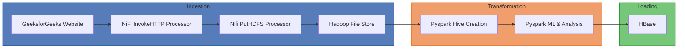

<b>Ingestion Layer:</b>
The pipeline begins by ingesting data from the GeeksforGeeks website using the InvokeHTTP Processor in Apache NiFi. This processor fetches the dataset and stores it in a Hadoop file system (HDFS) location under /data/zillow/ using the PutHDFS Processor. This process ensures that the raw data is safely and efficiently stored for further processing.

<b>Transformation Layer:</b>
Once the data is stored in HDFS, the pipeline utilizes Pyspark to create a Hive table. This table serves as a foundation for advanced data transformations. After the data is ingested into the Hive table, Pyspark is employed for data cleaning, feature engineering, and machine learning model development. The transformation layer processes the data in preparation for subsequent analysis and reporting.

<b>Loading Layer:</b>
After processing and transformation, the results are loaded into both HBase and Hive databases for persistent storage and querying. HBase serves as the real-time storage solution for large, non-relational datasets, while Hive is used for batch processing and integration with SQL-based analysis tools.

<br>

### Issues Encountered

While the core data pipeline was implemented smoothly, I encountered significant challenges integrating Apache Hive.

Despite modifying the hive-site.xml file and trying various configurations, including localhost and port forwarding, NiFi was unable to establish a successful connection with Hive. After several attempts, it became clear that the integration between NiFi and Hive was not functioning as expected. This issue could be related to network configurations, port access, or version compatibility between NiFi and Hive.

To resolve this, I decided to pivot and use PySpark for table creation and ingestion into hive. By leveraging PySpark, I was able to create the necessary Hive tables and handle the ingestion process directly within the transformation layer, bypassing the NiFi-Hive connection issues. This approach allowed the pipeline to continue processing data as intended, albeit with a slight adjustment in the architecture.

<br>

### Successful Pipeline Execution
___

#### GeeksforGeeks data:
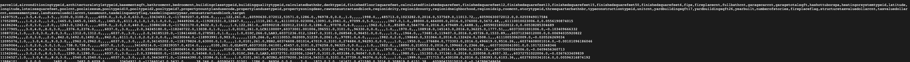
<br>This is the data that is hosted on geeksforgeeks website found here:
https://media.geeksforgeeks.org/wp-content/uploads/20240902152815/Zillow.csv

#### Nifi Ingestion:

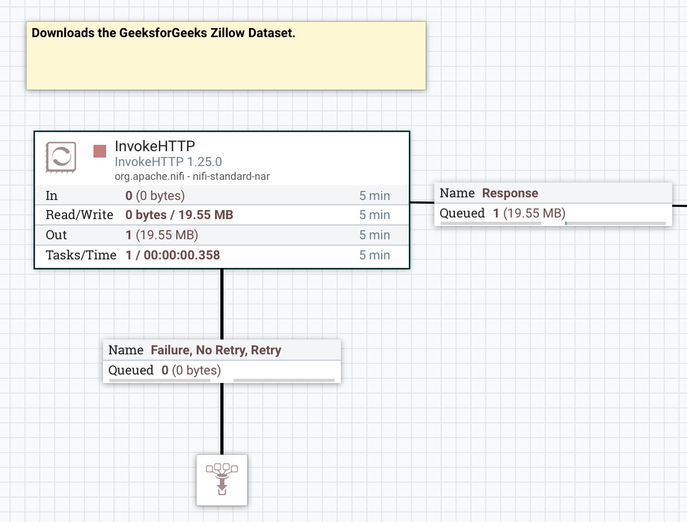
<br>This is where the data was ingested using NiFi and the InvokeHTTP processor.

#### Moving to HDFS:

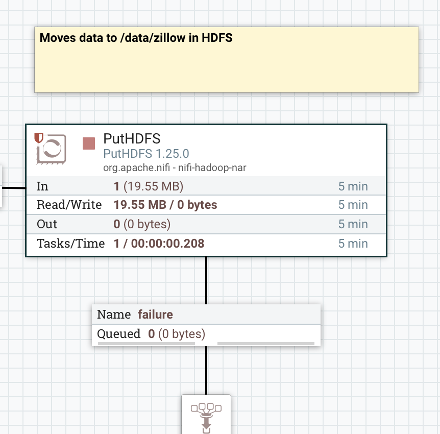
<br>This moves the data using NiFi's putHDFS processor to move the data to Hadoop File Storage.

#### Reading Data to PySpark from HDFS and writing to Hive Table
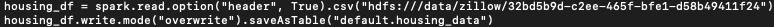
<br>This reads in the data from HDFS and writes the data as a Hive table.

#### Validating Table
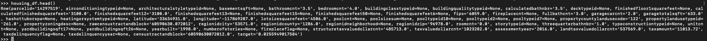
<br>This prints the head of the data to make sure that it formats it correctly for the table.

#### Performing "Analysis"
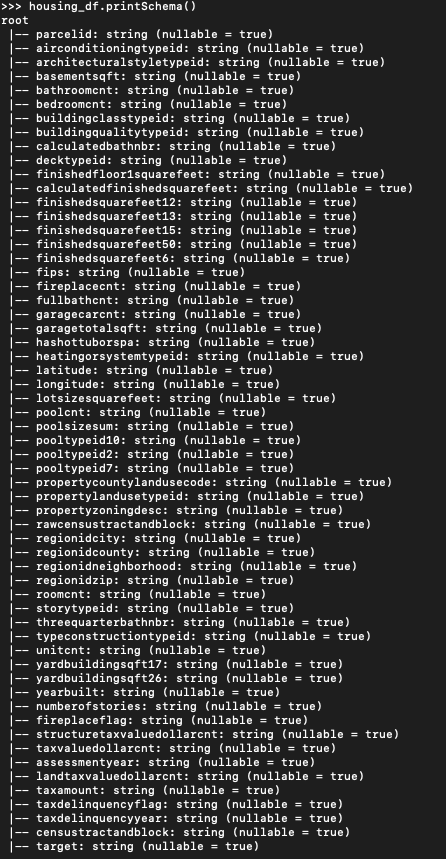
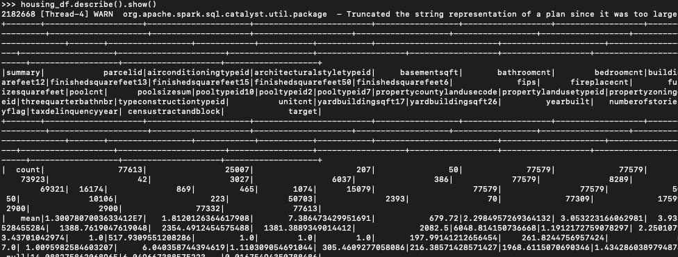
<br>Being completely transparent here. There is not much analysis going on because I didn't think there needed to be. This is more focused on the entire pipeline as a whole and didn't feel like doing a robust analysis would have been a good use of time. I thought focusing on trying to get direct NiFi-Hive integration was more useful. You can do basic SELECT Queries from the Hive table. You can use any SQL query really to investigate the data. You can also read in the data as a dataframe and investigate the data that way. I personally enjoy pyspark more than I enjoy SQL, so my "analysis" is done in pyspark.


** Extra that I just wanted to attempt
#### Moving Data to HBase
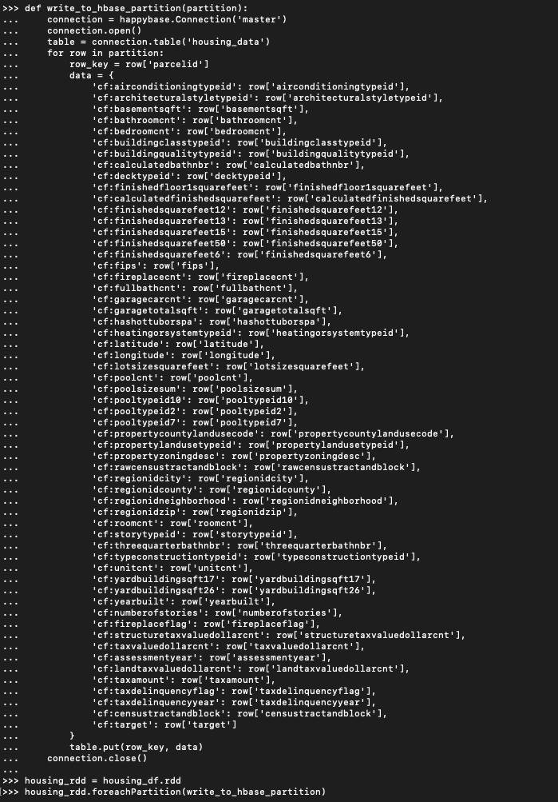
<br> This associates all the data into an appropriate hash with column family associations.


#### Validating HBase Load Success
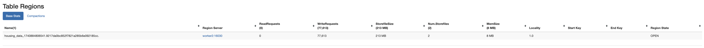
<br>This is the HBase UI that shows the data has successfully written to the table.

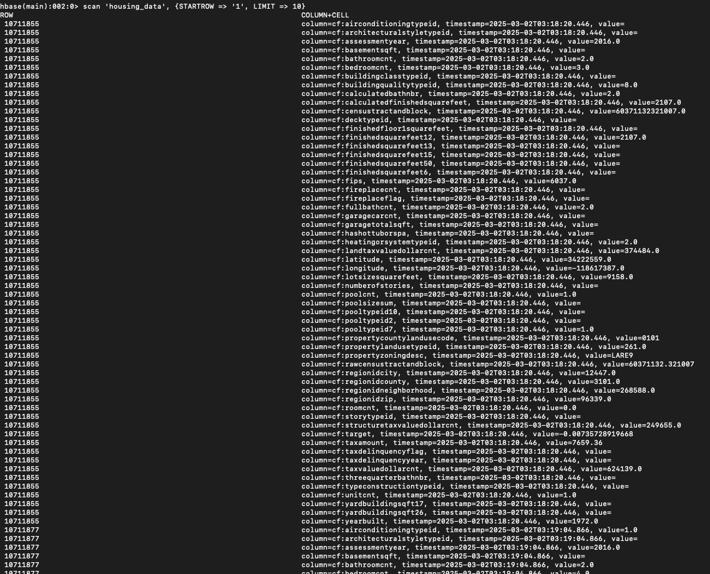
<br>This is just a basic query to check the first 10 rows to make sure that it inserted correctly (it did).

### Code
___
#### NiFi Project Template

```XML
<?xml version="1.0" encoding="UTF-8" standalone="yes"?>
<template encoding-version="1.3">
    <description></description>
    <groupId>538fb33d-0195-1000-1435-8ce9db1bb034</groupId>
    <name>Dschincke_650_project_template</name>
    <snippet>
        <processors>
            <id>a6309a5f-4eca-31d8-0000-000000000000</id>
            <parentGroupId>6f910b7d-83b4-3315-0000-000000000000</parentGroupId>
            <position>
                <x>0.0</x>
                <y>0.0</y>
            </position>
            <versionedComponentId>42ffb181-fe1d-34fd-a8ca-9f31f8c323d6</versionedComponentId>
            <bundle>
                <artifact>nifi-hadoop-nar</artifact>
                <group>org.apache.nifi</group>
                <version>1.25.0</version>
            </bundle>
            <config>
                <backoffMechanism>PENALIZE_FLOWFILE</backoffMechanism>
                <bulletinLevel>WARN</bulletinLevel>
                <comments></comments>
                <concurrentlySchedulableTaskCount>1</concurrentlySchedulableTaskCount>
                <descriptors>
                    <entry>
                        <key>Hadoop Configuration Resources</key>
                        <value>
                            <name>Hadoop Configuration Resources</name>
                        </value>
                    </entry>
                    <entry>
                        <key>kerberos-credentials-service</key>
                        <value>
                            <identifiesControllerService>org.apache.nifi.kerberos.KerberosCredentialsService</identifiesControllerService>
                            <name>kerberos-credentials-service</name>
                        </value>
                    </entry>
                    <entry>
                        <key>kerberos-user-service</key>
                        <value>
                            <identifiesControllerService>org.apache.nifi.kerberos.KerberosUserService</identifiesControllerService>
                            <name>kerberos-user-service</name>
                        </value>
                    </entry>
                    <entry>
                        <key>Kerberos Principal</key>
                        <value>
                            <name>Kerberos Principal</name>
                        </value>
                    </entry>
                    <entry>
                        <key>Kerberos Keytab</key>
                        <value>
                            <name>Kerberos Keytab</name>
                        </value>
                    </entry>
                    <entry>
                        <key>Kerberos Password</key>
                        <value>
                            <name>Kerberos Password</name>
                        </value>
                    </entry>
                    <entry>
                        <key>Kerberos Relogin Period</key>
                        <value>
                            <name>Kerberos Relogin Period</name>
                        </value>
                    </entry>
                    <entry>
                        <key>Additional Classpath Resources</key>
                        <value>
                            <name>Additional Classpath Resources</name>
                        </value>
                    </entry>
                    <entry>
                        <key>Directory</key>
                        <value>
                            <name>Directory</name>
                        </value>
                    </entry>
                    <entry>
                        <key>Conflict Resolution Strategy</key>
                        <value>
                            <name>Conflict Resolution Strategy</name>
                        </value>
                    </entry>
                    <entry>
                        <key>writing-strategy</key>
                        <value>
                            <name>writing-strategy</name>
                        </value>
                    </entry>
                    <entry>
                        <key>Block Size</key>
                        <value>
                            <name>Block Size</name>
                        </value>
                    </entry>
                    <entry>
                        <key>IO Buffer Size</key>
                        <value>
                            <name>IO Buffer Size</name>
                        </value>
                    </entry>
                    <entry>
                        <key>Replication</key>
                        <value>
                            <name>Replication</name>
                        </value>
                    </entry>
                    <entry>
                        <key>Permissions umask</key>
                        <value>
                            <name>Permissions umask</name>
                        </value>
                    </entry>
                    <entry>
                        <key>Remote Owner</key>
                        <value>
                            <name>Remote Owner</name>
                        </value>
                    </entry>
                    <entry>
                        <key>Remote Group</key>
                        <value>
                            <name>Remote Group</name>
                        </value>
                    </entry>
                    <entry>
                        <key>Compression codec</key>
                        <value>
                            <name>Compression codec</name>
                        </value>
                    </entry>
                    <entry>
                        <key>Ignore Locality</key>
                        <value>
                            <name>Ignore Locality</name>
                        </value>
                    </entry>
                </descriptors>
                <executionNode>ALL</executionNode>
                <lossTolerant>false</lossTolerant>
                <maxBackoffPeriod>10 mins</maxBackoffPeriod>
                <penaltyDuration>30 sec</penaltyDuration>
                <properties>
                    <entry>
                        <key>Hadoop Configuration Resources</key>
                        <value>/home/dexterschincke/dsc650-infra/bellevue-bigdata/nifi/hadoopconf/core-site.xml</value>
                    </entry>
                    <entry>
                        <key>kerberos-credentials-service</key>
                    </entry>
                    <entry>
                        <key>kerberos-user-service</key>
                    </entry>
                    <entry>
                        <key>Kerberos Principal</key>
                    </entry>
                    <entry>
                        <key>Kerberos Keytab</key>
                    </entry>
                    <entry>
                        <key>Kerberos Password</key>
                    </entry>
                    <entry>
                        <key>Kerberos Relogin Period</key>
                        <value>4 hours</value>
                    </entry>
                    <entry>
                        <key>Additional Classpath Resources</key>
                    </entry>
                    <entry>
                        <key>Directory</key>
                        <value>/data/zillow</value>
                    </entry>
                    <entry>
                        <key>Conflict Resolution Strategy</key>
                        <value>fail</value>
                    </entry>
                    <entry>
                        <key>writing-strategy</key>
                        <value>writeAndRename</value>
                    </entry>
                    <entry>
                        <key>Block Size</key>
                    </entry>
                    <entry>
                        <key>IO Buffer Size</key>
                    </entry>
                    <entry>
                        <key>Replication</key>
                    </entry>
                    <entry>
                        <key>Permissions umask</key>
                    </entry>
                    <entry>
                        <key>Remote Owner</key>
                    </entry>
                    <entry>
                        <key>Remote Group</key>
                    </entry>
                    <entry>
                        <key>Compression codec</key>
                        <value>NONE</value>
                    </entry>
                    <entry>
                        <key>Ignore Locality</key>
                        <value>false</value>
                    </entry>
                </properties>
                <retryCount>10</retryCount>
                <runDurationMillis>0</runDurationMillis>
                <schedulingPeriod>0 sec</schedulingPeriod>
                <schedulingStrategy>TIMER_DRIVEN</schedulingStrategy>
                <yieldDuration>1 sec</yieldDuration>
            </config>
            <executionNodeRestricted>false</executionNodeRestricted>
            <name>PutHDFS</name>
            <relationships>
                <autoTerminate>false</autoTerminate>
                <name>failure</name>
                <retry>false</retry>
            </relationships>
            <relationships>
                <autoTerminate>true</autoTerminate>
                <name>success</name>
                <retry>false</retry>
            </relationships>
            <state>STOPPED</state>
            <style/>
            <type>org.apache.nifi.processors.hadoop.PutHDFS</type>
        </processors>
    </snippet>
    <timestamp>03/02/2025 00:10:37 UTC</timestamp>
</template>

```
>This is my project xml file that can be used to create new projects from.

#### Reading in data from HDFS using PySpark
```python
from pyspark.sql import SparkSession
spark = SparkSession.builder \
.appName("hive_project") \
.enableHiveSupport() \
.getOrCreate() # Enables Hive Support

housing_df = spark.read.option("header", True).csv("hdfs:///data/zillow/32bd5b9d-c2ee-465f-bfe1-d58b49411f24") # Writes as dataframe
```
>This is where I am reading in the file as a pyspark df.

#### Creating Hive table with PySpark

```python
housing_df.write.mode("overwrite").saveAsTable("default.housing_data") # Writes to table
```
> This is where I am writing my PySpark DF as a table in my default schema.

#### Reading Hive Data in PySpark
```python
df = spark.sql("SELECT * FROM housing_data") # Select statement to validate data
df.show()
```
> This is where I am validating that everything loaded correctly.

#### Passing Data from PySpark to HBase

```python
spark = SparkSession.builder.appName('WriteToHBaseWithHappybase').getOrCreate()

def write_to_hbase_partition(partition):
    connection = happybase.Connection('master')
    connection.open()
    table = connection.table('housing_data')
    for row in partition:
        row_key = row['parcelid']
        data = {
            'cf:airconditioningtypeid': row['airconditioningtypeid'],
            'cf:architecturalstyletypeid': row['architecturalstyletypeid'],
            'cf:basementsqft': row['basementsqft'],
            'cf:bathroomcnt': row['bathroomcnt'],
            'cf:bedroomcnt': row['bedroomcnt'],
            'cf:buildingclasstypeid': row['buildingclasstypeid'],
            'cf:buildingqualitytypeid': row['buildingqualitytypeid'],
            'cf:calculatedbathnbr': row['calculatedbathnbr'],
            'cf:decktypeid': row['decktypeid'],
            'cf:finishedfloor1squarefeet': row['finishedfloor1squarefeet'],
            'cf:calculatedfinishedsquarefeet': row['calculatedfinishedsquarefeet'],
            'cf:finishedsquarefeet12': row['finishedsquarefeet12'],
            'cf:finishedsquarefeet13': row['finishedsquarefeet13'],
            'cf:finishedsquarefeet15': row['finishedsquarefeet15'],
            'cf:finishedsquarefeet50': row['finishedsquarefeet50'],
            'cf:finishedsquarefeet6': row['finishedsquarefeet6'],
            'cf:fips': row['fips'],
            'cf:fireplacecnt': row['fireplacecnt'],
            'cf:fullbathcnt': row['fullbathcnt'],
            'cf:garagecarcnt': row['garagecarcnt'],
            'cf:garagetotalsqft': row['garagetotalsqft'],
            'cf:hashottuborspa': row['hashottuborspa'],
            'cf:heatingorsystemtypeid': row['heatingorsystemtypeid'],
            'cf:latitude': row['latitude'],
            'cf:longitude': row['longitude'],
            'cf:lotsizesquarefeet': row['lotsizesquarefeet'],
            'cf:poolcnt': row['poolcnt'],
            'cf:poolsizesum': row['poolsizesum'],
            'cf:pooltypeid10': row['pooltypeid10'],
            'cf:pooltypeid2': row['pooltypeid2'],
            'cf:pooltypeid7': row['pooltypeid7'],
            'cf:propertycountylandusecode': row['propertycountylandusecode'],
            'cf:propertylandusetypeid': row['propertylandusetypeid'],
            'cf:propertyzoningdesc': row['propertyzoningdesc'],
            'cf:rawcensustractandblock': row['rawcensustractandblock'],
            'cf:regionidcity': row['regionidcity'],
            'cf:regionidcounty': row['regionidcounty'],
            'cf:regionidneighborhood': row['regionidneighborhood'],
            'cf:regionidzip': row['regionidzip'],
            'cf:roomcnt': row['roomcnt'],
            'cf:storytypeid': row['storytypeid'],
            'cf:threequarterbathnbr': row['threequarterbathnbr'],
            'cf:typeconstructiontypeid': row['typeconstructiontypeid'],
            'cf:unitcnt': row['unitcnt'],
            'cf:yardbuildingsqft17': row['yardbuildingsqft17'],
            'cf:yardbuildingsqft26': row['yardbuildingsqft26'],
            'cf:yearbuilt': row['yearbuilt'],
            'cf:numberofstories': row['numberofstories'],
            'cf:fireplaceflag': row['fireplaceflag'],
            'cf:structuretaxvaluedollarcnt': row['structuretaxvaluedollarcnt'],
            'cf:taxvaluedollarcnt': row['taxvaluedollarcnt'],
            'cf:assessmentyear': row['assessmentyear'],
            'cf:landtaxvaluedollarcnt': row['landtaxvaluedollarcnt'],
            'cf:taxamount': row['taxamount'],
            'cf:taxdelinquencyflag': row['taxdelinquencyflag'],
            'cf:taxdelinquencyyear': row['taxdelinquencyyear'],
            'cf:censustractandblock': row['censustractandblock'],
            'cf:target': row['target']
        }
    table.put(row_key, data)
connection.close()

housing_rdd = housing_df.rdd
housing_rdd.foreachPartition(write_to_hbase_partition)
```
> A lot of this was used in direct relation to the script provided in the write HBasePyspark Docx. I made a few changes like iterating over my dataframe to get the appropriate rows and data associations. I then use the partitions to write it to the corresponding hbase partitions.


```
scan 'housing_data', {STARTROW => '1', LIMIT => 10}
```
>This is a basic query I used in the HBase CLI to make sure that the data inserted correctly. It just gets the first 10 records. Nothing Fancy.

**Note
This is just additional items that I did not use in the pipeline but would have been used if I created the tables without using PySpark.
#### Hive Table Creation and Insertion

```SQL
CREATE TABLE property_data(
    parcelid BIGINT,
    airconditioningtypeid INT,
    architecturalstyletypeid INT,
    basementsqft DOUBLE,
    bathroomcnt DOUBLE,
    bedroomcnt INT,
    buildingclasstypeid INT,
    buildingqualitytypeid INT,
    calculatedbathnbr DOUBLE,
    decktypeid INT,
    finishedfloor1squarefeet DOUBLE,
    calculatedfinishedsquarefeet DOUBLE,
    finishedsquarefeet12 DOUBLE,
    finishedsquarefeet13 DOUBLE,
    finishedsquarefeet15 DOUBLE,
    finishedsquarefeet50 DOUBLE,
    finishedsquarefeet6 DOUBLE,
    fips INT,
    fireplacecnt INT,
    fullbathcnt INT,
    garagecarcnt INT,
    garagetotalsqft DOUBLE,
    hashottuborspa INT,
    heatingorsystemtypeid INT,
    latitude DOUBLE,
    longitude DOUBLE,
    lotsizesquarefeet DOUBLE,
    poolcnt INT,
    poolsizesum DOUBLE,
    pooltypeid10 INT,
    pooltypeid2 INT,
    pooltypeid7 INT,
    propertycountylandusecode STRING,
    propertylandusetypeid INT,
    propertyzoningdesc STRING,
    rawcensustractandblock STRING,
    regionidcity INT,
    regionidcounty INT,
    regionidneighborhood INT,
    regionidzip INT,
    roomcnt INT,
    storytypeid INT,
    threequarterbathnbr DOUBLE,
    typeconstructiontypeid INT,
    unitcnt INT,
    yardbuildingsqft17 DOUBLE,
    yardbuildingsqft26 DOUBLE,
    yearbuilt INT,
    numberofstories INT,
    fireplaceflag INT,
    structuretaxvaluedollarcnt DOUBLE,
    taxvaluedollarcnt DOUBLE,
    assessmentyear INT,
    landtaxvaluedollarcnt DOUBLE,
    taxamount DOUBLE,
    taxdelinquencyflag INT,
    taxdelinquencyyear INT,
    censustractandblock STRING,
    target DOUBLE
)
ROW FORMAT DELIMITED
FIELDS TERMINATED BY ','
STORED AS TEXTFILE
tblproperties("skip.header.line.count"="1");
```

#### Hive Table Insertion
```SQL
LOAD DATA INPATH '/data/zillow/d4b59b8d-3894-41a4-a298-000c91400211' INTO TABLE property_data;
```

#### Hive Table Validation
```SQL
SELECT
    *
FROM
    property_data
LIMIT
    10;
```


### Improvements

<b>Option 1: Kafka-Driven Near Real-Time Processing with NiFi and Spark</b>

This enhancement introduces Kafka into the existing NiFi pipeline to enable near real-time data processing while maintaining batch capabilities. Instead of NiFi writing directly to HDFS, it will publish data to Kafka, allowing multiple consumers to process data simultaneously.

1. A Kafka topic would be set up to receive Zillow data as it is fetched by NiFi.
NiFi would publish data to this Kafka topic instead of directly writing to HDFS.
2. A Kafka consumer in NiFi would pull data from Kafka and write it to HDFS for batch processing in Hive.
3. Spark Streaming would consume data from Kafka in real-time, process it, and write the results to HBase for fast querying.
4. Solr would index data from HBase, making real-time search and analysis possible.
5. This approach allows for both batch and real-time processing while improving scalability, resilience, and data freshness.

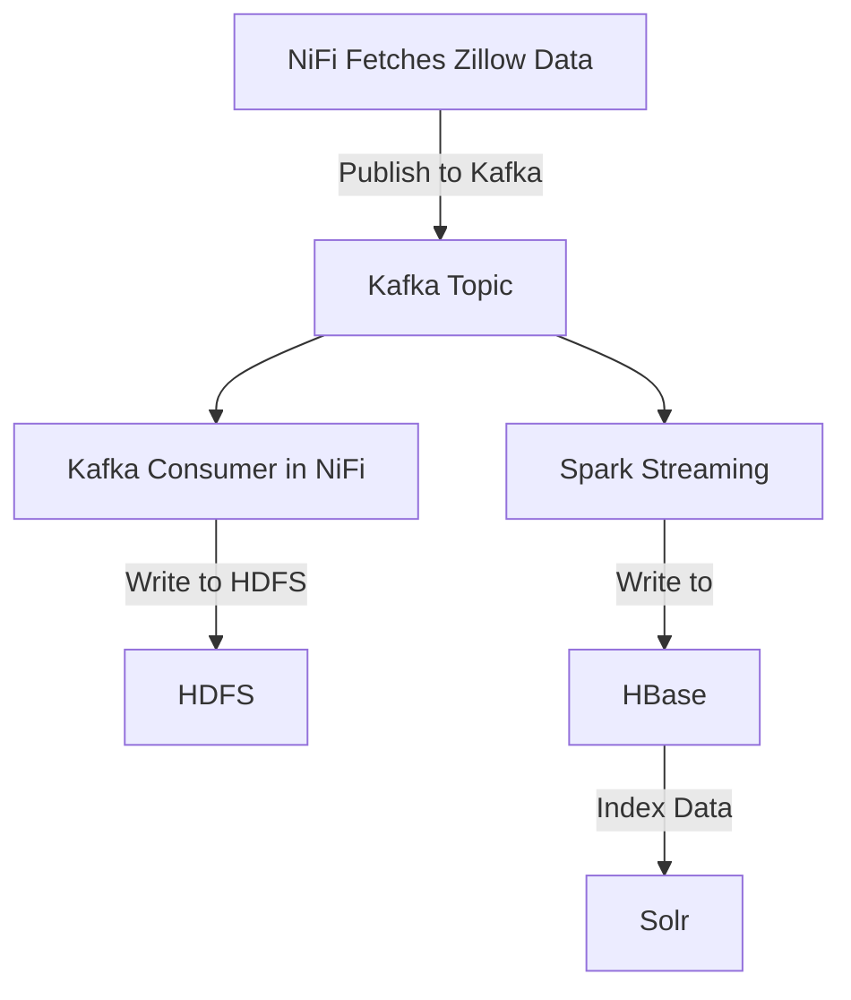

<b>Option 2: Batch Processing with Prefect, ECS, and DBT</b>

To enhance the efficiency, scalability, and maintainability of the pipeline, I plan to make significant architectural changes. These improvements will streamline integration, improve performance, and allow for better orchestration and data governance. Below are two options for refining the pipeline:

In this approach, I would replace NiFi with Prefect as the orchestrator due to its cleaner UI and better management capabilities. The infrastructure would involve ECS (Elastic Container Service) and ECR (Elastic Container Registry) to manage containerized workloads.

1. A Prefect deployment (defined in a prefect-deployment.yml file) would launch a virtual environment, likely using UV for its Rust-based performance improvements.
2. The pipeline would fetch data directly via HTTPX, storing it as a Polars or PySpark dataframe (depending on size).
3. Pandera would validate the data schema before further processing.
4. Depending on the dataset size, I would use PySpark or Polars for transformation and analysis.
5. DBT (Data Build Tool), integrated with Prefect, would push the cleaned data to a designated schema (e.g., test or prod).
6. Prefect’s scheduler would automate pipeline executions, ensuring timely batch updates.

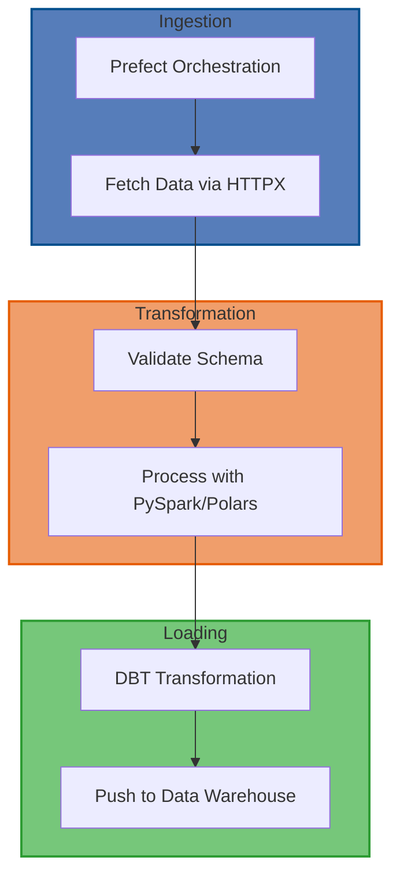


<b>Option 3: Streaming Architecture with Kafka and Incremental DBT Updates</b>
Instead of batch processing, this approach leverages Kafka for real-time data ingestion, allowing a continuous data stream. This will closely follow the first pipeline with a few edits.

1. A Kafka topic would be set up to publish incoming data as it is pulled.
2. The Prefect pipeline would consume messages from Kafka instead of manually fetching data in batch intervals.
3. Data validation would still be handled by Pandera.
4. The transformation step with PySpark/Polars would occur in near real-time.
5. DBT would be configured for incremental updates, ensuring that only new data gets processed and pushed into the warehouse.

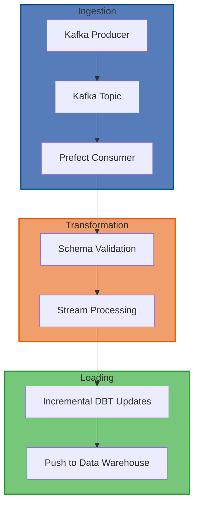

### Conclusion
This project focused on the end-to-end design and implementation of a data pipeline for processing and analyzing housing data. Using tools like Apache NiFi, PySpark, Hive, and HBase, I developed a robust system to automate the data ingestion, transformation, and storage process. The project began with setting up NiFi to download and process real estate data, followed by transforming the raw data using PySpark. The transformed data was then stored in Hive for easy querying and HBase for efficient real-time analysis. This pipeline demonstrated how powerful the integration of these tools can be for streamlining data processing workflows and creating a solid foundation for further analysis.

One of the key challenges encountered was integrating NiFi with Hive, which required overcoming some issues related to NiFi's inability to directly write data to Hive tables. However, I tackled this challenge by utilizing PySpark to create and manage the Hive tables, ensuring that data could still be ingested and transformed as expected. This solution provided valuable insights into the flexibility required when working with various data engineering tools. It also highlighted the need for continuous problem-solving and creative thinking when dealing with technical roadblocks. Through this experience, I gained hands-on knowledge of troubleshooting integration issues and adapting to system limitations.

Looking forward, this pipeline lays a strong foundation for potential future expansions. The next steps could involve incorporating real-time data streaming for more dynamic housing analytics or expanding the data processing capabilities to handle larger datasets. The project not only emphasized the importance of automation in data engineering but also demonstrated the critical role of flexibility and adaptability when building data pipelines. With this solid framework in place, the pipeline can be easily scaled and enhanced to meet the needs of future data analysis tasks in the real estate sector. This experience reinforced my understanding of how data engineering solutions are essential for turning raw data into valuable insights that drive business decisions.

<br>
<br>

___
** Note to the professor

Very impressed you made it this far down in the report (I tend to overthink a few things and it spills onto the page). Wanted to give you a few additional words to read aside from the short novel I drafted above.

I would like to sincerely thank you for your time, effort, and guidance throughout this course. Your expertise and support have been invaluable in helping me develop both my technical and analytical skills. I truly appreciate the way you fostered an environment where learning was not only encouraged but also engaging and insightful. This class has provided me with a deeper understanding of the key concepts in data engineering and allowed me to apply them in real-world projects, which has been incredibly rewarding. I’m grateful for the opportunity to learn from you, and I feel more confident and prepared to continue growing in the field of data science thanks to your instruction.

___